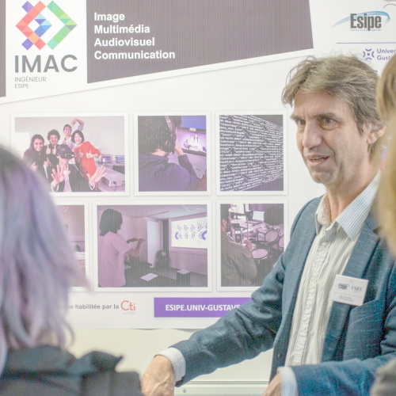

# RAPPORT WORKSHOP 

Réalisé par Milan Junges et Laurine Suel

 
Semaine du 20/11/2023 
  
<a href="https://github.com/ElMilaan/Workshop-Laurine.S_Milan" style= "font-style: italic;font-weight:bold;"> > Repo Github < </a>

## Table des matières
___

- [Introduction](#introduction)
- [Première journée](#première-journée-de-workshop)
- [Deuxième Journée](#deuxième-journée-de-workshop)
- [Troisième Journée](#troisième-journée-de-workshop)
- [Quatrième Journée](#quatrième-jour-de-workshop)
- [Conclusion](#conclusion)
___

## Introduction 

 La manipulation d'images représente un domaine fascinant qui fusionne créativité et compétences techniques et scientifiques.   Dans ce rapport vous trouverez le rendu d'un atelier enrichissant qui s'est tenu dans le cadre d'un workshop, dédié à l'exploration et à la maîtrise du codage d'effets sur des images.  Au cours de cette semaine, nous avons ont été guidés à travers des exercices en utilisant le langage de programmation C++. Nous avons donc pu coder plusieurs effets visuels, allant des transformations simples d'une image aux manipulations plus avancées comme la créations d'effets sur image.

 Nous avons travaillé à partir de deux images données, le logo Imac (image 1) et une photographie (image 2).

| {: height="200px";} | {: height="200px";} |
| -------------------------------------------------------------- | ----------------------------------------------------------- |
| Image 1                                                        | Image 2                                                     |

___

## Première journée de workshop

 Nous avons entamé cette première journée de workshop par cinq exercices de niveau ⭐ (1 étoile).

#### ⭐ Ne gardez que le vert

 Le but ici était de garder uniquement la valeur de la composante verte du logo. Ce qui nous donne donc... un logo tout vert.

| {: height="200px";} | {: height="200px";} |
| -------------------------------------------------------------- | ---------------------------------------------------------------- |
| Avant                                                          | Après                                                            |

#### ⭐ Échanger les canaux

 Ici, nous avons codé un programme qui échange les composantes bleues et rouges de chaque pixel.

| {: height="200px";} | {: height="200px";} |
| -------------------------------------------------------------- | ---------------------------------------------------------------------- |
| Avant                                                          | Après                                                                  |

#### ⭐ Noir & blanc

 Pour obtenir un logo noir et blanc nous avons, pour chacun des pixels qui composent l'image, calculé la moyenne des valeurs de ses composantes rouge, verte et bleue. Cette moyenne a été ensuite affectée à chacune des composantes du pixel. 

| {: height="200px";} | {: height="200";} |
| -------------------------------------------------------------- | --------------------------------------------------------------------------------- |
| Avant                                                          | Après                                                                             |

#### ⭐ Négatif

 Pour cet effet, nous avons inverser la valeur de chaque composante rouge, verte et bleue de chacun des pixels qui composent notre image (1 - valeur)

| {: height="200px";} | {: height="200px";} |
| -------------------------------------------------------------- | ---------------------------------------------------------------------- |
| Avant                                                          | Après                                                                  |

#### ⭐ Dégradé

 L'exercice suivant consistait à créer un dégradé de couleur (ici du noir vers le blanc). Pour faire cela, nous parcourons l'image de gauche à droite et nous éclaircissons les pixels en fonction de leur position dans l'image. Plus le pixel est proche du bord gauche, plus il sera sombre et au contraire, plus le pixel est proche du bord droit, plus il deviendra clair. 

| {: height="200px";} | {: height="200px";width="200px"} |
| ----------------------------------------------------------------- | ----------------------------------------------------------------------------- |
| Avant                                                             | Après                                                                         |

 Nous avons poursuivi par six exercices de niveau ⭐⭐ (2 étoiles).

#### ⭐⭐ Miroir

 Notre premier essaie de programme a permis de créer le "miroir raté". Dans ce programme il nous faut parcourir l'image entière (x par y). Une fois arrivé à la moitié de l'image, le programme reporte la partie gauche de l'image sur la partie droite de la bonne manière. Mais par symétrie, cette nouvelle partie droite est à nouveau reportée en miroir sur la partie gauche qui avait déjà été parcourue. Cela entraine le report de la partie droite (déjà modifiée) sur la partie gauche de l'image (cela n'a donc pas modifié cette partie gauche). <!-- Il aurait été intéressant d'expliquer comment vous avez résolu ce problème -->

| {: height="200px";} | {: height="200px";} | {: height="200px";} |
| -------------------------------------------------------------- | ----------------------------------------------------------------------------- | ------------------------------------------------------------------- |
| logo classique                                                 | miroir raté                                                                   | résultat final                                                      |

#### ⭐⭐ Bruitage

 Pour avoir ce rendu "bruité" de notre logo, nous avons utilisé pour la première fois dans ce workshop des valeurs aléatoires. En effet, pour obtenir cette transformation, nous devions parcourir l'image et changer la couleur de pixels aléatoires avec des valeurs aléatoires. 

| {: height="200px";} | {: height="200px";} |
| -------------------------------------------------------------- | ------------------------------------------------------------------- |
| Avant                                                          | Après                                                               |

#### ⭐⭐ Rotation de 90

 Pour faire tourner notre image à 90°, nous avons reporté chaque pixel vers une nouvelle coordonnée, celle-ci est calculée grâce à une formule générique qui fonctionne pour chacun des pixels de l'image. Dans cet exercice, la difficulté a été d'adapter les dimensions de la nouvelle image etant donné que l'image utilisée est un rectangle. La largeur devient hauteur (x devient img.width() - y) et inversement (y devient x). 

| {: height="200px";} | {: height="175px";} |
| -------------------------------------------------------------- | --------------------------------------------------------------------------- |
| Avant                                                          | Après                                                                       |

#### ⭐⭐ Split

 Ce nouvel effet consiste à donner à chacun des pixels de l'image la valeur de composante rouge d'un pixel un peu à sa gauche et la valeur de composante bleue d'un pixel un peu à sa droite dans l'image (attention il ne faut pas chercher une valeur de pixel qui est en dehors de l'image). La valeur de la composante verte de chaque pixel ne change pas. 

| {: height="200px";} | {: height="200px";} | {: height="200px";} |
| -------------------------------------------------------------- | ---------------------------------------------------------------------- | ----------------------------------------------------------------------------------------- |
| logo classique                                                 | split demandé                                                          | split sans vert                                                                           |

#### ⭐⭐ Luminosité

 Eclaircir une photo, ou l'assombrir a été un peu plus compliqué que simplement augmenter ou diminuer les valeurs des composantes de couleur des pixels. En effet, additionner ou soustraire des valeurs à ces composantes donnera un rendu où les blancs et les noirs sont trop agressifs et peu agréables à l'oeil. Nous avons donc utilisé les puissances pour augmenter ou diminuer les valeurs de composantes des pixels de l'image. Ainsi, plus la puissance est élevée, plus l'image sera sombre et inversement. 

| {: height="200px";} | {: height="200px";} | {: height="200px";} |
| ------------------------------------------------------------- | ------------------------------------------------------------------- | ---------------------------------------------------------------------- |
| photo classique                                               | photo éclaircie                                                     | photo assombrie                                                        |

#### ⭐⭐ Disque

 Créer un disque sur une image noire a été un exercice plutôt simple pour nous. En effet nous nous sommes servi de la formule de l'équation du cercle : 

\[ (x - a)^2 + (y - b)^2 = r^2 \]
où :
- \( (x, y) \) sont les coordonnées d'un point sur le cercle,
- \( (a, b) \) sont les coordonnées du centre du cercle,
- \( r \) est le rayon du cercle.

 En parcourant l'image, si un pixel se trouve être à une coordonnée à l'intérieur du cercle, alors il devient blanc, sinon il ne change pas.

| {: height="200px";} | {: height="200px";} |
| ----------------------------------------------------------------- | -------------------------------------------------------- |
| Avant                                                             | Après                                                    |

___

## Deuxième journée de workshop

 Dans la matinée de cette deuxième journée, nous avons créé deux images. 

#### ⭐ Cercle

 Cet exercice est similaire à celui du disque. Nous avons seulement ajouté une condition pour qu'un pixel se colore en blanc. En effet, si le pixel se situe dans le cercle dont on a déterminé l'équation, il faut également qu'il se situe dans l'espace que nous avons défini comme étant le contours du cercle (variable en fonction de l'épaisseur que l'on veut lui donner). 

| {: height="200px";} | {: height="200px";} |
| ----------------------------------------------------------------- | ---------------------------------------------------------- |
| Avant                                                             | Après                                                      |

#### ⭐⭐⭐ Rosace

 Pour dessiner cette rosace, nous avons réutilisé notre programme permettant de tracer un cercle que nous avons répété 7 fois (ou plus en fonction de la complexité de la rosace souhaitée). Pour commencer, nous avons tracé le cercle au centre de l'image. Ensuite, nous nous sommes servi de ce dernier comme cercle trigonométrique. Ainsi nous avons pu placer chacun des autres cercles dont le centre a été calculé tous les π/3, ce qui nous donne cette belle rosace. Si plus de cercles sont tracés, il faut alors choisir des intervalles proportionnellement moins espacées sur le cercle trigonométrique. 

| {: height="200px";} | {: height="200px"} |
| ----------------------------------------------------------------- | --------------------------------------------------------- |
| Avant                                                             | Après                                                     |

 Ensuite dans l'après-midi nous avons réalisé une mosaïque ainsi que l'exercice « glitch ». 

#### ⭐⭐ Mosaïque

 Pour créer notre mosaïque, nous avons procédé de deux manières différentes. 

 
Méthode 1 : 

 Nous avons tout d'abord réduit notre image en gardant 1 pixel sur 5 du logo, puis nous avons dupliqué cette petite image pour remplir notre grande image noire (les dimensions de l'image finale sont donc les même que celles du logo avant rétrécissement)

| {: height="200px";} | {: height="200px";} |
| --------------------------------------------------------------------- | -------------------------------------------------------------------------------- |
| Avant                                                                 | Après                                                                            |

 
Méthode 2 : 

 À l'inverse de la méthode 1, nous avons multiplié par 5 notre image noire, et nous avons dupliqué notre logo dans cette image. On observe donc une mozaïque beaucoup moins pixalisée <!-- Vous n'avez pas installé le correcteur d'orthographe que je propose dans le cours dur Markdown ? Ca vous aurait évité ces diverses coquilles -->. Nous avons deux méthodes pour ce programme là.

| {: height="200px";} | {: height="200px";} |
| -------------------------------------------------------- | -------------------------------------------------------------------------------- |
| Avant                                                    | Après                                                                            |

#### ⭐⭐⭐ Glitch

 Afin d'obtenir cet effet de glitch, nous avons de nouveau utilisé des valeurs aléatoires. Dans un premier temps, nous avons obtenu un résultat assez  visuel mais il n'était pas du tout celui attendu. Effectivement nous avions fait un mauvais calcul de coordonnées et mal utilisé les variables aléatoire. Le bon algorithme que nous avons finalement appliqué consiste à prendre un rectancle de pixels de taille aléatoire puis un endroit aléatoire dans l'image et enfin d'échanger ce rectangle avec un autre rectangle de pixels de même taille mais placé à un autre endroit (aléatoire lui aussi) de l'image.

| {: height="200px";} | {: height="200px";} | {: height="200px";} |
| -------------------------------------------------------------- | ----------------------------------------------------------------------------------------- | -------------------------------------------------------------------- |
| logo classique                                                 | glitch raté                                                                               | glitch demandé                                                       |

___

## Troisième journée de workshop

#### ⭐⭐⭐ Fractale

 Nous avons obtenu en premier temps une fractale pixelisée, puis dans un second temps la fractale attendue (que nous avons embellie avec une jolie couleur). 

 Réussir cette fractale était notre objectif au début de ce workshop, au vu de sa belle forme assez complexe. Nous avons utilisé les nombres complexes pour obtenir ce résultat. En effet à l'aide d'une librairie C++ nous avons manipulé des nombres complexes sur lesquels nous avons effectuer des opérations. Ainsi, pour chaque pixel, en fonction de sa position (x,y), sa couleur est déterminée. Nous le voyons bien avec les nuances de gris qui entourent notre fractale. 

| {: height="200px";} | {: height="200px";} |
| --------------------------------------------------------------------------------- | ------------------------------------------------------------- |
| fractale pixelisée                                                                | fractale                                                      |

#### ⭐⭐⭐⭐ Convolutions 

 Aprés avoir réalisé les différents exercices de convolutions, nous avons décidé d'écrire un programme qui peut réaliser toutes les convolutions ( blur, outline, sharpen et emboss ). Ainsi, en passant en paramètre de notre fonction l'effet souhaité, le bon programme sera lu par la machine et le résultat sera celui voulu ( utilisation du 'switch' ).  

 Le principe de la convolution consiste, pour chaque pixel, de regarder tous les pixels qui l'entourent dans un carré de pixels. En effectuant un calcul liant chacune des composantes des pixels qui composant le carré, on affecte une nouvelle valeur au pixel central.
Le calcul de la nouvelle valeur varie en fonction de l'effet souhaité. 

| {: height="200px";} | {: height="200px";} | {: height="200px";} | {: height="200px";} | {: height="200px";} |
| -------------------------------------------------------------- | ------------------------------------------------------ | ------------------------------------------------------------ | ------------------------------------------------------------ | ---------------------------------------------------------- |
| logo classique                                                 | blur                                                   | outline                                                      | sharpen                                                      | emboss                                                     |

#### ⭐⭐⭐(⭐) Tramage

 L'algorithme du tramage est plutôt simple à comprendre. Nous définissons ce que l'on appelle une matrice de Bayer (4x4) dont les valeurs sont constantes. En parcourant l'image pixel par pixel, le programme regarde s'il considère le pixel comme clair ou foncé. Dans le premier cas, il le transforme en pixel blanc, dans le second, en pixel noir. Un pixel est considéré comme clair ou sombre en fonction d'un certain seuil déterminé grâce à la matrice de Bayer et d'un coefficient qui peut être choisi par l'utilisateur. 

| {: height="200px";} | {: height="200px";} |
| --------------------------------------------------------- | -------------------------------------------------------------- |
| Avant                                                     | Après                                                          |

___

## Quatrième jour de workshop

#### ⭐⭐⭐⭐ Tri de pixels

 Pour effectuer un tri de pixel, nous avons écrit un programme qui parcourt l'image, ligne de pixels par ligne de pixels. Chaque ligne est ensuite parcourue et ses pixels sont triés du plus lumineux au plus sombre. La ligne est ensuite reportée sur l'image. Lorsque le programme a traité l'image entière, on obtient de résultat ci-dessous.

| {: height="200px";} | {: height="200px";} |
| -------------------------------------------------------- | ------------------------------------------------------- |
| Avant                                                    | Après                                                   |

___

## Conclusion

 Au-delà de la simple acquisition de compétences techniques, ce workshop nous a permis d'exprimer notre vision artistique à travers un langage de programmation (C++). Nous avons compris les concepts fondamentaux, expérimenté des techniques de programmation et collaboré par paires en utilisant git, un outil de versionning indispensable. Ce fut une riche experience éducative qui a su stimuler notre créativité dans le domaine captivant de la programmation d'effets sur images. 

 Un grand merci à Jules Fouchy pour l'organisation de ce workshop et ses precieux conseils qui ont su nous porter toute la semaine. 
