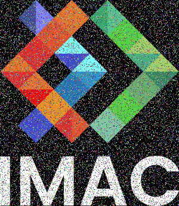
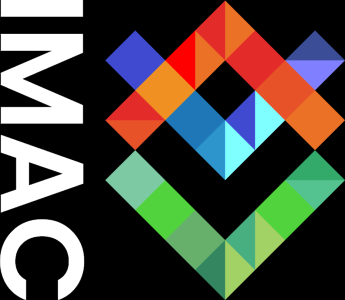
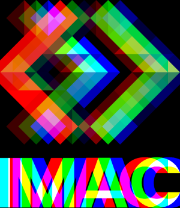

# RAPPORT WORKSHOP 
Réalisé par Milan Junges et Laurine Suel

 Semaine du 20/11/2023 

## Introduction 

 La manipulation d'images représente un domaine fascinant qui fusionne créativité et compétences techniques et scientifiques.   Dans ce rapport vous trouverez le rendu d'un atelier enrichissant qui s'est tenu dans le cadre d'un workshop, dédié à l'exploration et à la maîtrise du codage d'effets sur des images.  Au cours de cette semaine, nous avons ont été guidés à travers des exercices en utilisant le langage de programmation C++. Nous avons donc pu coder plusieurs effets visuels, allant des transformations simples d'une image aux manipulations plus avancées comme la créations d'effets sur image.

 Nous avons travaillé à partir de deux images données, le logo Imac (image 1) et une photographie (image 2).

| {: height="200px";} | {: height="200px";} |
| -------------------------------------------------------------- | ----------------------------------------------------------- |

## Première journée de workshop

 Nous avons entamé cette première journée de workshop par cinq exercices de niveau ⭐ (1 étoile).

#### ⭐ Ne gardez que le vert
| {: height="200px"; width="175px";} | {: height="200px";width="175";} |
| ----------------------------------------------------------------------------- | ---------------------------------------------------------------------------- |

#### ⭐ Échanger les canaux
| {: height="200px";width="175";} | {: height="200px";width="175";} |
| -------------------------------------------------------------------------- | ---------------------------------------------------------------------------------- |

#### ⭐ Noir & blanc
| {: height="200px";width="175px";} | {: height="200";width="175";} |
| ---------------------------------------------------------------------------- | --------------------------------------------------------------------------------------------- |

#### ⭐ Négatif
| {: height="200px";width="175";} | {: height="200px";width="175px";} |
| -------------------------------------------------------------------------- | ------------------------------------------------------------------------------------ |

#### ⭐ Dégradé
| {: height="200px";width="200px";} | {: height="200px"; width="200px"} |
| ------------------------------------------------------------------------------- | ------------------------------------------------------------------------------ |

 Nous avons poursuivi par six exercices de niveau ⭐⭐ (2 étoiles).

#### ⭐⭐ Miroir
| {: height="200px";width="175px";} | {: height="200px";width="175px";} | {: height="200px";width="175px";} |
| ---------------------------------------------------------------------------- | ------------------------------------------------------------------------------------------- | --------------------------------------------------------------------------------- |
| logo classique                                                               | miroir raté                                                                                 | résultat final                                                                    |

 Notre premier essaie de programme a permis de créer le miroir raté. Dans ce programme on parcourait l'image entière. Arrivé à la moitié de l'image, le programme avait reporté la partie gauche sur la partie droite de la bonne manière. Mais par symétrie, cette nouvelle partie droite était reportée en miroir sur la partie gauche qui avait déjà été parcourue. L'effet donné fut le report de la partie droite (déjà modifiée) sur la partie gauche de l'image (ça n'a donc pas modifié cette partie gauche).

#### ⭐⭐ Bruitage
| {: height="200px";width="175px";} | {: height="200px"; width="175px"} |
| ---------------------------------------------------------------------------- | --------------------------------------------------------------------------------- |

#### ⭐⭐ Rotation de 90
| {: height="200px";width="175px";} | {: height="175px"; width="200px"} |
| ---------------------------------------------------------------------------- | ----------------------------------------------------------------------------------------- |

#### ⭐⭐ Split
| {: height="200px";width="175px";} | {: height="200px";width="175px";} | {: height="200px";width="175px";} |
| ---------------------------------------------------------------------------- | ------------------------------------------------------------------------------------ | ------------------------------------------------------------------------------------------------------- |
| logo classique                                                               | split demandé                                                                        | split sans vert                                                                                         |

#### ⭐⭐ Luminosité
| {: height="200px";width="175px";} | {: height="200px";width="175px";} | {: height="200px";width="175px";} |
| ---------------------------------------------------------------------------- | ------------------------------------------------------------------------------------ | ------------------------------------------------------------------------------------------------------- |
| logo classique                                                               | split demandé                                                                        | split sans vert                                                                                         |

#### ⭐⭐ Rotation de 90
| {: height="200px";width="175px";} | {: height="200px"; width="175px"} |
| ---------------------------------------------------------------------------- | ----------------------------------------------------------------------------------------- |