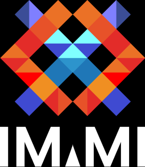
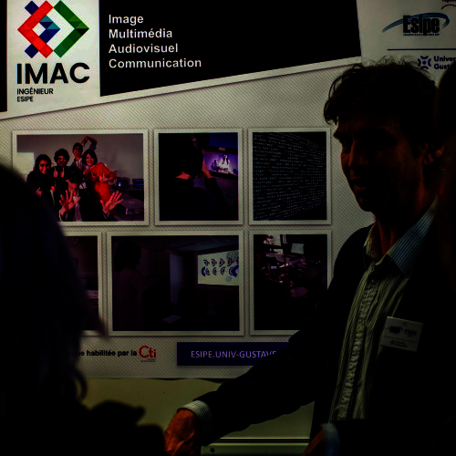
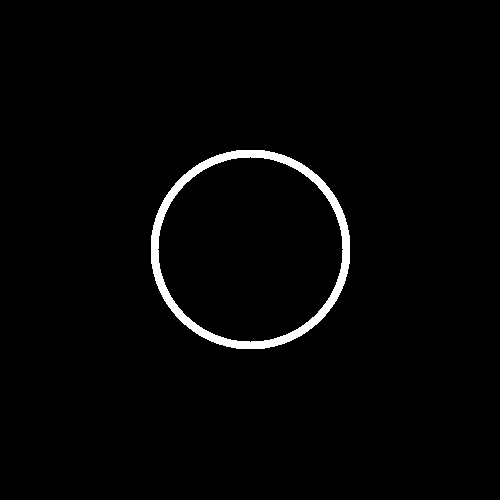
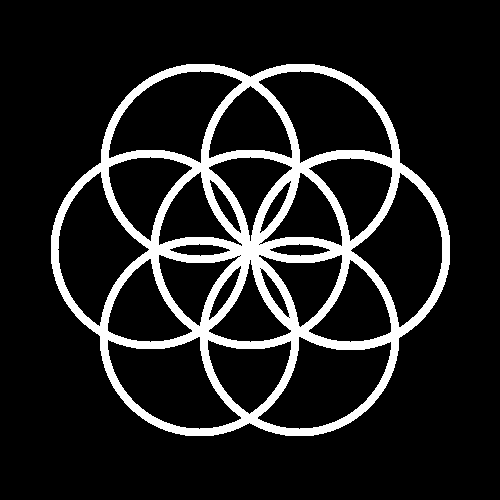
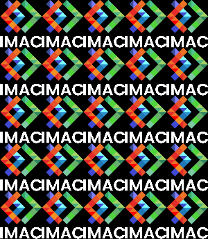
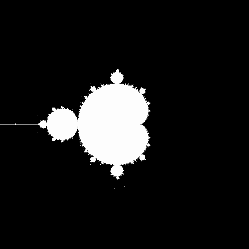
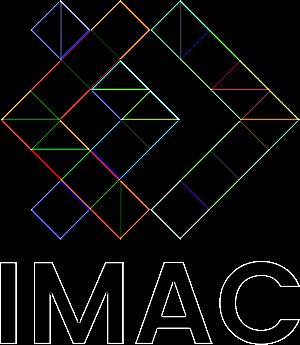

# RAPPORT WORKSHOP 
Réalisé par Milan Junges et Laurine Suel

 Semaine du 20/11/2023 

## Introduction 

 La manipulation d'images représente un domaine fascinant qui fusionne créativité et compétences techniques et scientifiques.   Dans ce rapport vous trouverez le rendu d'un atelier enrichissant qui s'est tenu dans le cadre d'un workshop, dédié à l'exploration et à la maîtrise du codage d'effets sur des images.  Au cours de cette semaine, nous avons ont été guidés à travers des exercices en utilisant le langage de programmation C++. Nous avons donc pu coder plusieurs effets visuels, allant des transformations simples d'une image aux manipulations plus avancées comme la créations d'effets sur image.

 Nous avons travaillé à partir de deux images données, le logo Imac (image 1) et une photographie (image 2).

| {: height="200px";} | {: height="200px";} |
| -------------------------------------------------------------- | ----------------------------------------------------------- |

## Première journée de workshop

 Nous avons entamé cette première journée de workshop par cinq exercices de niveau ⭐ (1 étoile).

#### ⭐ Ne gardez que le vert
| {: height="200px"; width="175px";} | {: height="200px";width="175";} |
| ----------------------------------------------------------------------------- | ---------------------------------------------------------------------------- |

#### ⭐ Échanger les canaux
| {: height="200px";width="175";} | {: height="200px";width="175";} |
| -------------------------------------------------------------------------- | ---------------------------------------------------------------------------------- |

#### ⭐ Noir & blanc
| {: height="200px";width="175px";} | {: height="200";width="175";} |
| ---------------------------------------------------------------------------- | --------------------------------------------------------------------------------------------- |

#### ⭐ Négatif
| {: height="200px";width="175";} | {: height="200px";width="175px";} |
| -------------------------------------------------------------------------- | ------------------------------------------------------------------------------------ |

#### ⭐ Dégradé
| {: height="200px";width="200px";} | {: height="200px"; width="200px"} |
| ------------------------------------------------------------------------------- | ------------------------------------------------------------------------------ |

 Nous avons poursuivi par six exercices de niveau ⭐⭐ (2 étoiles).

#### ⭐⭐ Miroir
| {: height="200px";width="175px";} | {: height="200px";width="175px";} | {: height="200px";width="175px";} |
| ---------------------------------------------------------------------------- | ------------------------------------------------------------------------------------------- | --------------------------------------------------------------------------------- |
| logo classique                                                               | miroir raté                                                                                 | résultat final                                                                    |

 Notre premier essaie de programme a permis de créer le miroir raté. Dans ce programme on parcourait l'image entière. Arrivé à la moitié de l'image, le programme avait reporté la partie gauche sur la partie droite de la bonne manière. Mais par symétrie, cette nouvelle partie droite était reportée en miroir sur la partie gauche qui avait déjà été parcourue. L'effet donné fut le report de la partie droite (déjà modifiée) sur la partie gauche de l'image (ça n'a donc pas modifié cette partie gauche).

#### ⭐⭐ Bruitage
| {: height="200px";width="175px";} | {: height="200px"; width="175px"} |
| ---------------------------------------------------------------------------- | --------------------------------------------------------------------------------- |

#### ⭐⭐ Rotation de 90
| {: height="200px";width="175px";} | {: height="175px"; width="200px"} |
| ---------------------------------------------------------------------------- | ----------------------------------------------------------------------------------------- |

#### ⭐⭐ Split
| {: height="200px";width="175px";} | {: height="200px";width="175px";} | {: height="200px";width="175px";} |
| ---------------------------------------------------------------------------- | ------------------------------------------------------------------------------------ | ------------------------------------------------------------------------------------------------------- |
| logo classique                                                               | split demandé                                                                        | split sans vert                                                                                         |

#### ⭐⭐ Luminosité
| {: height="200px";width="175px";} | {: height="200px";width="175px";} | {: height="200px";width="175px";} |
| --------------------------------------------------------------------------- | --------------------------------------------------------------------------------- | ------------------------------------------------------------------------------------ |
| photo classique                                                             | photo éclaircie                                                                   | photo assombrie                                                                      |

#### ⭐⭐ Disque
| {: height="200px";width="175px";} | {: height="200px"; width="175px"} |
| ------------------------------------------------------------------------------- | ---------------------------------------------------------------------- |

## Deuxième journée de workshop

 Dans la matinée de cette deuxième journée, nous avons créé deux images. 

#### ⭐ Cercle
| {: height="200px";width="175px";} | {: height="200px"; width="175px"} |
| ------------------------------------------------------------------------------- | ------------------------------------------------------------------------ |

#### ⭐⭐⭐ Rosace
| {: height="200px";width="175px";} | {: height="200px"; width="175px"} |
| ------------------------------------------------------------------------------- | ------------------------------------------------------------------------ |

 Ensuite dans l'aprés-midi nous avons réalisé une mosaïque ainsi que l'exercice « glitch ». 

#### ⭐⭐ Mosaïque

 Pour créer notre mosaïque, nous avons procédé de deux manières différentes. 

 
Méthode 1 : 

 Nous avons tout d'abord réduit notre image en gardant 1 pixel sur 5 du logo, puis nous avons dupliqué cette petite image pour remplir notre grande image noire. 

| {: height="200px";width="175px";} | {: height="200px"; width="175px"} |
| ----------------------------------------------------------------------------------- | ---------------------------------------------------------------------------------------------- |

 
Méthode 2 : 

 À l'inverse de la méthode 1, nous avons multiplié par 5 notre image noire, et nous avons dupliqué notre logo dans cette image. On observe donc une mozaïque beaucoup moins pixalisée. Nous avons deux méthodes pour ce programme là.

| {: height="200px";width="175px";} | {: height="200px"; width="175px"} |
| ---------------------------------------------------------------------- | ---------------------------------------------------------------------------------------------- |

#### ⭐⭐⭐ Glitch

| {: height="200px";width="175px";} | {: height="200px";width="175px";} | {: height="200px";width="175px";} |
| ---------------------------------------------------------------------------- | ------------------------------------------------------------------------------------------------------- | ---------------------------------------------------------------------------------- |
| logo classique                                                               | glitch raté                                                                                             | glitch demandé                                                                     |

## Troisième journée de workshop

#### ⭐⭐⭐ Fractale

 Nous avons obtenu en premier lieu une fractale plus pixelisée, puis nous avons obtenu la bonne fractale. 

| {: height="200px";width="175px";} | {: height="200px"; width="175px"} |
| ----------------------------------------------------------------------------------------------- | --------------------------------------------------------------------------- |
| fractale pixelisée                                                                              | fractale                                                                    |

#### ⭐⭐⭐⭐ Convolutions 

 Aprés avoir réalisé les différents exercices de convolutions, nous avons décidé d'écrire un programme qui peut réaliser toutes les convolutions (blur, outline, sharpen et emboss). À l'aide du 'swap' nous pouvons changer de fonction selon ce l'effet souhaité. 

| {: height="200px";width="150px";} | {: height="200px";width="150px";} | {: height="200px";width="150px";} | {: height="200px";width="150px";} | {: height="200px";width="150px";} |
| ---------------------------------------------------------------------------- | -------------------------------------------------------------------- | -------------------------------------------------------------------------- | -------------------------------------------------------------------------- | ------------------------------------------------------------------------ |
| logo classique                                                               | blur                                                                 | outline                                                                    | sharpen                                                                    | emboss                                                                   |

#### ⭐⭐⭐(⭐) Tramage

| {: height="200px";width="175px";} | {: height="200px"; width="175px"} |
| ----------------------------------------------------------------------- | ---------------------------------------------------------------------------- |

## Quatrième jour de workshop

#### ⭐⭐⭐⭐ Tri de pixels

| {: height="200px";width="175px";} | {: height="200px"; width="175px"} |
| ---------------------------------------------------------------------- | --------------------------------------------------------------------- |

##Conclusion

 Au-delà de la simple acquisition de compétences techniques, ce workshop nous a permis d'exprimer notre vision artistique à travers le langage du code. Nous avons compris les concepts fondamentaux, expérimenté des techniques de programmations et collaboré par pairs en utilisant git. Ce fut une riche experience éducative qui a su stimuler notre créativité dans le domaine captivant de la programmation d'effets sur images.
